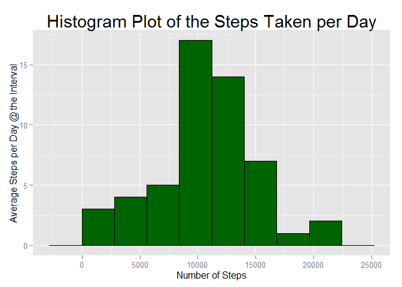
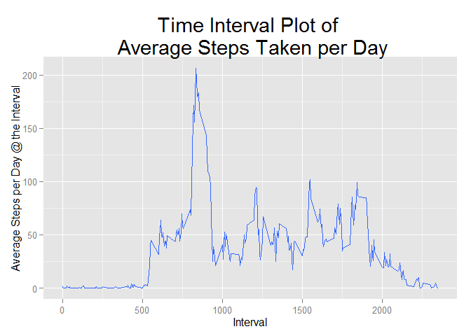
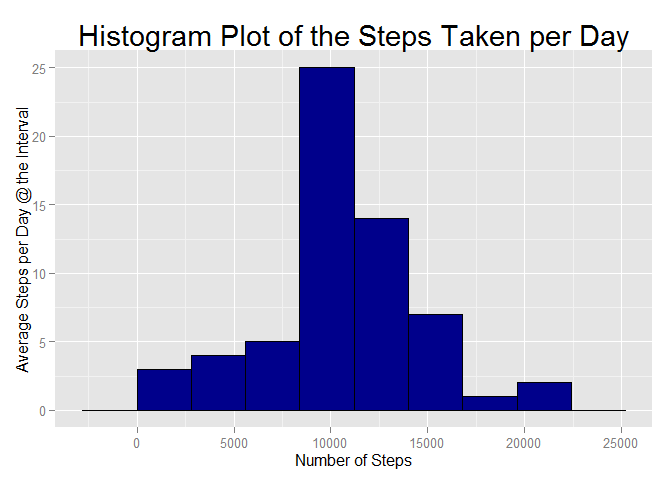
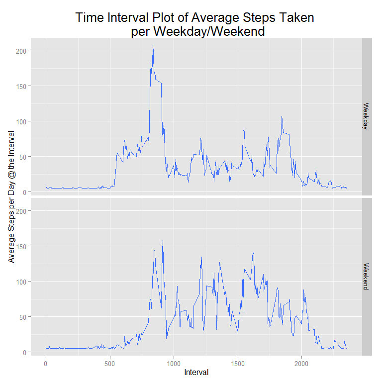

# Reproduceable Research Assignment 1
Louis Tham  
Friday, May 15, 2015  

### 1) Loading and Processing the Data

```r
## Remove everything within the environment
rm(list = ls())

library(plyr)
library(dplyr)
```

```
## Warning: package 'dplyr' was built under R version 3.1.3
```

```
## 
## Attaching package: 'dplyr'
## 
## The following objects are masked from 'package:plyr':
## 
##     arrange, count, desc, failwith, id, mutate, rename, summarise,
##     summarize
## 
## The following object is masked from 'package:stats':
## 
##     filter
## 
## The following objects are masked from 'package:base':
## 
##     intersect, setdiff, setequal, union
```

```r
library(ggplot2)
library(lubridate)
```

```
## Warning: package 'lubridate' was built under R version 3.1.3
```

```
## 
## Attaching package: 'lubridate'
## 
## The following object is masked from 'package:plyr':
## 
##     here
```

```r
## Cheeck if the folder "Explore_data" exist in the working directory, if not available, create it
#if (!file.exists("Reproduce_Data")) {
#        dir.create("Reproduce_Data")
#}

## Specify url location and download file to specified directory
#fileUrl <- "https://d396qusza40orc.cloudfront.net/repdata%2Fdata%2Factivity.zip"
#download.file(fileUrl, destfile = "./Reproduce_Data/repdata-data-activity.zip")

## Unzip the downloaded file and show the files extracted
unzip("./Reproduce_Data/repdata-data-activity.zip", exdir = "./Reproduce_Data")
list.files("./Reproduce_Data")
```

```
## [1] "activity.csv"              "repdata-data-activity.zip"
```

```r
## Read files
raw <- read.csv("./Reproduce_Data/activity.csv")

## Remove all NA data, eextract only data without NAs
data <- raw[complete.cases(raw),]
```


### 2) What is mean total number of steps taken per day?

```r
## Grouping the data based on Date
grouped_date_data <- group_by(data, date)

## Summarizing the total number of steps taken per day
summary <- summarise(grouped_date_data, total_steps = sum(steps, na.rm = TRUE))

mean_steps_byday <- mean(summary$total_steps, na.rm = TRUE)
median_steps_byday <- median(summary$total_steps, na.rm = TRUE)
```

#### a) Make a histogram of the total number of steps taken each day

```r
## Plot out histogram
g1 = ggplot(summary, aes(x = total_steps))
g2 = geom_histogram(colour = "black", fill = "dark green", binwidth = 2800) 
g3 = ggtitle('Histogram Plot of the Steps Taken per Day')
g4 = labs(y = "Average Steps per Day @ the Interval")
g5 = labs(x = "Number of Steps")
g6 = theme(plot.title = element_text(size = rel(1.8)))

g1 + g2 + g3 + g4 + g5 + g6
```

 

#### b) Calculate and report the mean and median total number of steps taken per day
 The mean total number of steps taken per day is 1.0766189\times 10^{4}.
 The median total number of steps taken per day is 10765.


### 3) What is the average daily activity pattern?

```r
## Grouping the data based on interval
grouped_interval_data <- group_by(data, interval)

## Summarizing the mean number of steps taken at each interval across all days measured
summary <- summarise(grouped_interval_data, mean_steps = mean(steps, na.rm = TRUE))

## Extracting the interval at which the highest average number of steps were taken
max_ave_step_interval <- filter(summary, mean_steps == max(summary$mean_steps))
max_ave_step_interval <- as.numeric(max_ave_step_interval[1,1]) 
```

#### a) Make a time series plot (i.e. type = "l") of the 5-minute interval (x-axis) and the average number of steps taken, averaged across all days (y-axis)

```r
## Plot out the time series plot of steps taken per day
g1 = ggplot(summary, aes(interval, mean_steps))
g2 = geom_smooth(stat = "identity")
g3 = labs(title = 'Time Interval Plot of \n Average Steps Taken per Day')
g4 = labs(y = "Average Steps per Day @ the Interval")
g5 = labs(x = "Interval")
g6 = theme(plot.title = element_text(size = rel(1.8)))

g1 + g2 + g3 + g4 + g5 + g6
```

 

#### b) Which 5-minute interval, on average across all the days in the dataset, contains the maximum number of steps?
The 5-minute interval that has the maximum number of steps averaged across all the days is at the 835 interval.


### 4) Imputing missing values
Investigation suggest that the the measurements are taken at 288 intervals of 5 minutes everyday. The missing data does not come from sub intervals within a day, but come from a full 288 intervals of 8 separate days. This means that a total of 2304 missing data coming from 8 separate days of measurements at 288 intervals of 5 minutes. Given this information, we can safely conduct the following:
1) Obtain the average steps per day per interval given the known data. 
2) Replace all missing data with the known average steps per day per interval. 
3) Save table with the updated data. 

```r
## Checking the number of rows that have NA data and where they are located
missing_rows <- nrow(raw) - nrow(data)
mean_steps_byinterval <- mean(data$step, na.rm = TRUE)

data <- raw
data[is.na(data)] = mean_steps_byinterval

## Grouping the data based on Date
grouped_date_data <- group_by(data, date)

## Summarizing the total number of steps taken per day
summary <- summarise(grouped_date_data, total_steps = sum(steps, na.rm = TRUE))

new_mean_steps_byday = mean(summary$total_steps, na.rm = TRUE)
new_median_steps_byday = median(summary$total_steps, na.rm = TRUE)
```

#### a) Calculate and report the total number of missing values in the dataset (i.e. the total number of rows with NAs)
There are 2304 number of rows with missing values in the dataset. 

#### b) Make a histogram of the total number of steps taken each day 

```r
## Plot out histogram
g1 = ggplot(summary, aes(x = total_steps))
g2 = geom_histogram(colour = "black", fill = "dark blue", binwidth = 2800) 
g3 = ggtitle('Histogram Plot of the Steps Taken per Day')
g4 = labs(y = "Average Steps per Day @ the Interval")
g5 = labs(x = "Number of Steps")
g6 = theme(plot.title = element_text(size = rel(1.8)))

g1 + g2 + g3 + g4 + g5 + g6
```

 

#### c) Calculate and report the mean and median total number of steps taken per day. 
The NEW mean total number of steps taken per day after replacing the missing data with the mean value of the known data is 1.0766189\times 10^{4}.

The NEW median total number of steps taken per day after replacing the missing data with the mean value of the known data is 1.0766189\times 10^{4}.

#### d) Do these values differ from the estimates from the first part of the assignment?
The mean remains the same as the missing values are replaced with the same mean value identified from the known data.

The median changes as it moves closer to the mean value since more data reflects the mean of the dataset. 

#### e) What is the impact of imputing missing data on the estimates of the total daily number of steps?
The data becomes more normally distributed with the mean and the median agreeing with one another. 

### 5) Are there differences in activity patterns between weekdays and weekends?
Yes, there are higher number of steps taken between the 800~900 intervals during the weekdays and lower steps subsequently. The steps taken between the 1000 ~ 2000 interval during the weekend are generally higher than the weekdays during the same interval. 

#### a) Create a new factor variable in the dataset with two levels - "weekday" and "weekend" indicating whether a given date is a weekday or weekend day.

```r
## Identify weekdays/weekends
data$date = as.Date(data$date) 

data$Day = weekdays(data$date)

data$Type = ifelse(data$Day == "Saturday" | data$Day == "Sunday",
                         "Weekend", "Weekday")

## Grouping the data based on Date
grouped_Type_data <- group_by(data, Type, interval)

## Summarizing the total number of steps taken per day
summary <- summarise(grouped_Type_data, mean_steps = mean(steps, na.rm = TRUE))
```

#### b) Make a panel plot containing a time series plot (i.e. type = "l") of the 5-minute interval (x-axis) and the average number of steps taken, averaged across all weekday days or weekend days (y-axis). The plot should look something like the following, which was creating using simulated data:

```r
## Plot out the time series plot of steps taken per day
g1 = ggplot(summary, aes(interval, mean_steps))
g2 = facet_grid(Type ~.) 
g3 = geom_smooth(stat = "identity") 
g4 = labs(title = 'Time Interval Plot of Average Steps Taken \n per Weekday/Weekend')
g5 = labs(y = "Average Steps per Day @ the Interval")
g6 = labs(x = "Interval")
g7 = theme(plot.title = element_text(size = rel(1.6)))

g1 + g2 + g3 + g4 + g5 + g6 + g7
```

 


### End of Report.
